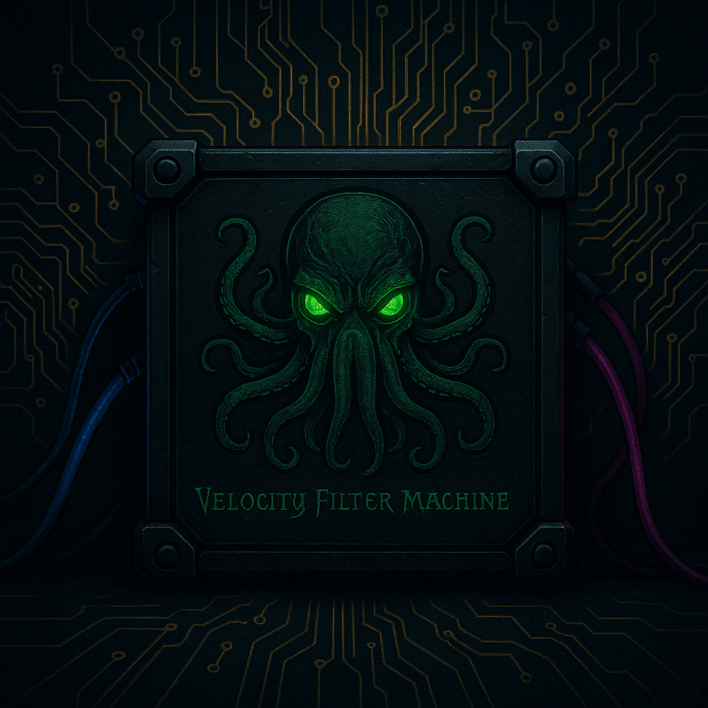
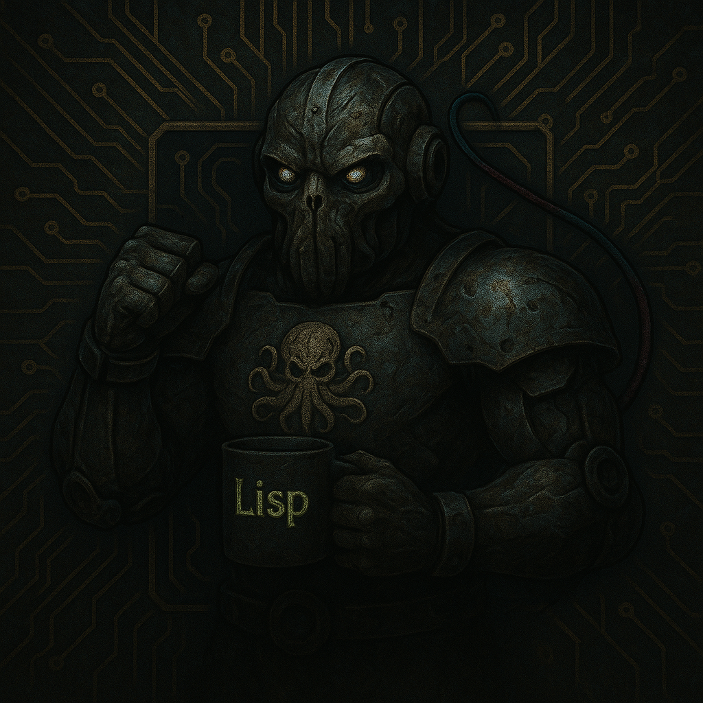

# Velocity Filter Machine (VFM)


> P̷̩͗ä̵̩̪́͠ċ̶͓̪͋k̵̟̓͂e̸̢̻̽̎t̵̼̕s̶̝̈́͛ ̴̙̓a̶͎͗r̸̨̛̅e̸̖͛̚ ̶͙͌͠b̸̻̈̒ę̶̗̓t̸͇̰͋t̴̜̑ë̸̡́̇r̶͈̠̆ ̶̢̈́f̷̢͊͘i̷̤̐̐l̶̤̺̐̊t̴̰͗e̵̩̙͝r̵͕̚e̵͈͐d̴͈͝͝ ̶͓͝b̶͕͛̇y̶͖͌ ̴̤̈́a̸̼̺͂͂ ̵͖̾͘V̴̼͋̅í̷̜r̴͖͐t̶̨͗́u̷̻̪̍a̵̪̹͠l̸̳̄ ̴̹̃̋M̸͉̓͐a̶̬̯͒̍c̵̥̞̾h̶̲̥͛̓ì̷̦n̷̘̖̔̏e̴̠̩͌

A high-performance packet filtering virtual machine in C, optimized for processing millions of packets per second. VFM features both a high-level Lisp-like DSL (VFLisp) for intuitive filter development and a low-level bytecode interpreter for maximum performance.

## Overview

VFM is designed to be the fastest, safest packet filtering VM available. It combines:

- **VFLisp DSL**: High-level Lisp-like language for intuitive filter programming
- **High Performance**: Optimized interpreter with computed goto dispatch achieving 10M+ packets/second
- **Safety First**: Static program verification prevents crashes and ensures bounded execution
- **Zero-Copy**: Direct packet access without memory copying for maximum throughput
- **Cross-Platform**: Runs on Linux, macOS, and BSD systems
- **BPF Compatible**: Compiles VFM bytecode to native BPF for kernel integration
- **JIT Compilation**: x86-64 and ARM64 JIT compilers for maximum performance

## Use Cases

### Network Security
- **DDoS Protection**: Detect and mitigate volumetric attacks
- **Intrusion Detection**: Identify malicious traffic patterns
- **Rate Limiting**: Enforce per-source connection limits

### Traffic Analysis
- **Protocol Analysis**: Parse and classify network protocols
- **Flow Monitoring**: Track connection states and metrics
- **Performance Monitoring**: Measure latency and throughput

### Edge Computing
- **IoT Filtering**: Lightweight packet processing for constrained devices
- **CDN Optimization**: Intelligent traffic routing and caching
- **Load Balancing**: Distribute traffic based on custom rules

## Installation

### Prerequisites
- GCC or Clang compiler
- Make
- Standard C library

### Build from Source
```bash
git clone https://github.com/MonkeyIsNull/VelocityFilterMachine 
cd VelocityFilterMachine
make all
```

This builds:
- `libvfm.a` - Core VFM library
- `vflispc` - VFLisp compiler (Lisp → bytecode)
- `vfm-asm` - Assembler (assembly → bytecode)
- `vfm-dis` - Disassembler (bytecode → text)
- `vfm-test` - Filter testing tool

### Single Header Library
For easy integration, use the single header version:
```c
#define VFM_IMPLEMENTATION
#include "include/vfm.h"
```

## Quick Start

### Option 1: VFLisp (Recommended)

#### 1. Write a VFLisp Filter
Create or use inline expressions:
```lisp
; Simple TCP port 80 filter
(and (= proto 6)
     (= dst-port 80))
```

#### 2. Compile and Test
```bash
# Compile inline expression
./dsl/vflisp/vflispc -e '(and (= proto 6) (= dst-port 80))' -o http_filter.bin

# Test with example packet
./dsl/vflisp/vflispc -t http_filter.bin

# Show generated assembly
./dsl/vflisp/vflispc -d http_filter.bin
```

### Option 2: Assembly Programming

#### 1. Write Assembly Filter
Create `my_filter.vfm`:
```assembly
; Simple TCP port 80 filter
LD16 12         ; Load EtherType
PUSH 0x0800     ; IPv4
JNE reject

LD8 23          ; Load IP protocol
PUSH 6          ; TCP
JNE reject

LD16 36         ; Load destination port
PUSH 80         ; HTTP
JEQ accept

reject:
    RET 0       ; Drop packet
accept:
    RET 1       ; Accept packet
```

#### 2. Compile to Bytecode
```bash
./tools/vfm-asm my_filter.vfm -o my_filter.bin
```

#### 3. Test the Filter
```bash
./tools/vfm-test my_filter.bin test_packets.pcap
```

### 4. Integrate in C Code
```c
#include "src/vfm.h"

int main() {
    vfm_state_t *vm = vfm_create();
    
    // Option 1: Compile VFLisp directly
    uint8_t *bytecode;
    uint32_t bytecode_len;
    char error_msg[256];
    
    if (vfl_compile_string("(= proto 6)", &bytecode, &bytecode_len, 
                          error_msg, sizeof(error_msg)) == 0) {
        vfm_load_program(vm, bytecode, bytecode_len);
        free(bytecode);
    }
    
    // Option 2: Load pre-compiled filter
    // vfm_load_program_file(vm, "my_filter.bin");
    
    // Process packets
    int result = vfm_execute(vm, packet_data, packet_len);
    if (result == 1) {
        // Accept packet
    } else {
        // Drop packet
    }
    
    vfm_destroy(vm);
    return 0;
}
```

## Running Tests

### Unit Tests
```bash
make test
```

Runs comprehensive test suite covering:
- VM creation and destruction
- Bounds checking and safety
- Stack operations and arithmetic
- Packet loading and parsing
- Control flow and jumps
- Flow table operations
- Error handling

### Performance Benchmarks
```bash
make benchmark
```

Measures:
- Packets per second throughput
- Nanoseconds per packet latency
- CPU cycles per instruction
- Memory usage patterns

### Individual Test Files
```bash
# Test specific functionality
cd test/
gcc -I../src debug_execute.c ../src/vfm.c ../src/verifier.c -o debug_execute
./debug_execute

# Verify programs
gcc -I../src simple_verify.c ../src/verifier.c -o simple_verify
./simple_verify
```

## Project Structure

```
VelocityFilterMachine/
├── src/                    # Core implementation
│   ├── vfm.c              # Main VM interpreter
│   ├── vfm.h              # Public API
│   ├── opcodes.h          # Instruction definitions
│   ├── verifier.c         # Safety validation
│   ├── compiler.c         # BPF compilation
│   ├── jit_x86_64.c       # x86-64 JIT
│   └── jit_arm64.c        # ARM64 JIT
├── dsl/vflisp/             # VFLisp DSL implementation
│   ├── vflispc.c          # VFLisp compiler CLI
│   ├── vflisp_parser.c    # S-expression parser
│   ├── vflisp_compile.c   # AST to bytecode compiler
│   ├── vflisp_types.h     # Language types and definitions
│   └── examples/          # VFLisp filter examples
├── tools/                  # Command-line tools
│   ├── vfm-asm.c          # Assembler
│   ├── vfm-dis.c          # Disassembler
│   └── vfm-test.c         # Testing tool
├── examples/               # Example filters
│   ├── tcp_filter.vfm     # TCP filtering (assembly)
│   ├── ddos_detect.vfm    # DDoS detection (assembly)
│   ├── rate_limit.vfm     # Rate limiting (assembly)
│   └── *.bin              # Compiled bytecode
├── test/                   # Test suite
│   ├── test_vfm.c         # Unit tests
│   ├── test_packets.pkt   # Test data
│   └── debug_*.c          # Debug tools
├── bench/                  # Performance benchmarks
│   └── bench.c
├── include/                # Single header library
│   └── vfm.h
├── docs/                   # Programming documentation
│   ├── programming_manual.md  # Complete programming guide
│   ├── *.vfm              # Working filter examples
│   └── *.c                # C integration examples
└── Makefile               # Build configuration
```

## Documentation

For comprehensive programming documentation, see the [docs/](docs/) directory:

- **[Programming Manual](docs/programming_manual.md)** - Complete guide with VFLisp DSL, assembly reference, examples, and best practices
- **[VFLisp Examples](dsl/vflisp/examples/)** - Working VFLisp filter examples for common use cases
- **[Assembly Examples](docs/)** - Working VFM assembly examples for advanced use cases
- **[C Integration](docs/unit_test_style.c)** - Example showing proper API usage

The programming manual covers:
- **VFLisp DSL language reference** - High-level filter programming
- **Assembly instruction set reference** - Low-level bytecode programming
- Programming patterns and techniques for both VFLisp and assembly
- Real-world security filtering examples
- Performance optimization strategies
- Debugging and troubleshooting
- Full API documentation

## Advanced Usage

### VFLisp Language Reference


VFLisp provides an intuitive Lisp-like syntax for packet filtering:

**Basic Syntax:**
```lisp
(operator operand1 operand2 ...)
```

**Packet Fields:**
- `proto` - IP protocol (6=TCP, 17=UDP, 1=ICMP)
- `src-ip`, `dst-ip` - IP addresses
- `src-port`, `dst-port` - Port numbers
- `ethertype` - Ethernet frame type (0x0800=IPv4)
- `ip-len` - IP packet length
- `tcp-flags` - TCP flags byte

**Comparison Operations:**
- `(= proto 6)` - Equal
- `(!= src-port 80)` - Not equal
- `(> ip-len 1400)` - Greater than
- `(< dst-port 1024)` - Less than

**Logical Operations:**
- `(and condition1 condition2)` - Logical AND
- `(or condition1 condition2)` - Logical OR
- `(not condition)` - Logical NOT

**Arithmetic Operations:**
- `(+ value1 value2)` - Addition
- `(- value1 value2)` - Subtraction
- `(* value1 value2)` - Multiplication
- `(& flags mask)` - Bitwise AND

**Control Flow:**
- `(if condition then-expr else-expr)` - Conditional

**Example Filters:**
```lisp
; Accept only TCP traffic
(= proto 6)

; Web traffic (HTTP/HTTPS)
(and (= proto 6)
     (or (= dst-port 80) (= dst-port 443)))

; Block large UDP packets
(not (and (= proto 17) (> ip-len 1400)))
```

### Assembly Language Reference
For advanced users, VFM also supports low-level assembly programming:

**Packet Access:**
- `LD8 offset` - Load byte from packet
- `LD16 offset` - Load 16-bit value (network order)
- `LD32 offset` - Load 32-bit value (network order)
- `LD64 offset` - Load 64-bit value (network order)

**Stack Operations:**
- `PUSH value` - Push 64-bit immediate
- `POP` - Pop top value
- `DUP` - Duplicate top value
- `SWAP` - Swap top two values

**Arithmetic:**
- `ADD`, `SUB`, `MUL`, `DIV`, `MOD`
- `AND`, `OR`, `XOR`, `NOT`
- `SHL`, `SHR` - Bit shifting

**Control Flow:**
- `JMP offset` - Unconditional jump
- `JEQ offset` - Jump if equal
- `JNE offset` - Jump if not equal
- `JGT offset` - Jump if greater
- `JLT offset` - Jump if less
- `RET` - Return with top stack value

### VFLisp Command Line Tool
The VFLisp compiler provides various options:
```bash
# Compile expression to bytecode
./dsl/vflisp/vflispc -e '(= proto 6)' -o tcp_filter.bin

# Show Abstract Syntax Tree
./dsl/vflisp/vflispc -a -e '(and (= proto 6) (= dst-port 80))'

# Disassemble compiled bytecode
./dsl/vflisp/vflispc -d tcp_filter.bin

# Test with example packet
./dsl/vflisp/vflispc -t tcp_filter.bin

# Compile from file
./dsl/vflisp/vflispc filter.vfl -o filter.bin
```

### BPF Compilation
Convert VFM bytecode to BPF:
```bash
./tools/vfm-compile filter.bin --target=ebpf -o filter.bpf
```

### JIT Compilation
Enable JIT for maximum performance:
```c
vfm_state_t *vm = vfm_create();
vfm_enable_jit(vm);  // Compile to native code
```

## Performance

VFM achieves exceptional performance through:

- **VFLisp Optimization**: High-level DSL compiles to efficient bytecode
- **Computed Goto**: Eliminates switch statement overhead
- **Cache Optimization**: Data structures aligned for modern CPUs
- **Bounds Checking**: Optimized memory access validation
- **JIT Compilation**: Native code generation for hot paths

Benchmark results on Apple M1:
- **VFLisp filters**: 20M+ packets/second
- **Assembly filters**: 25M+ packets/second
- **Complex filters**: 10M+ packets/second
- **Memory usage**: <1MB per VM instance

## Security

VFM prioritizes safety with:

- **VFLisp Type Safety**: High-level DSL prevents many programming errors
- **Static Verification**: Programs validated before execution
- **Bounded Execution**: Instruction count limits prevent infinite loops
- **Memory Safety**: All packet access is bounds-checked
- **Stack Protection**: Stack overflow/underflow detection
- **No Unsafe Operations**: No raw memory access or system calls

## Contributing

1. Fork the repository
2. Create a feature branch
3. Make your changes
4. Add tests for new functionality
5. Run the test suite: `make test`
6. Submit a pull request

## License

MIT License - see LICENSE file for details.

## Performance Goals

- **Throughput**: 10M+ packets/second for simple filters
- **Latency**: <50ns per packet overhead
- **Memory**: <1MB per VM instance
- **Safety**: Zero crashes on malformed bytecode
- **Compatibility**: Runs on Linux, macOS, BSD

